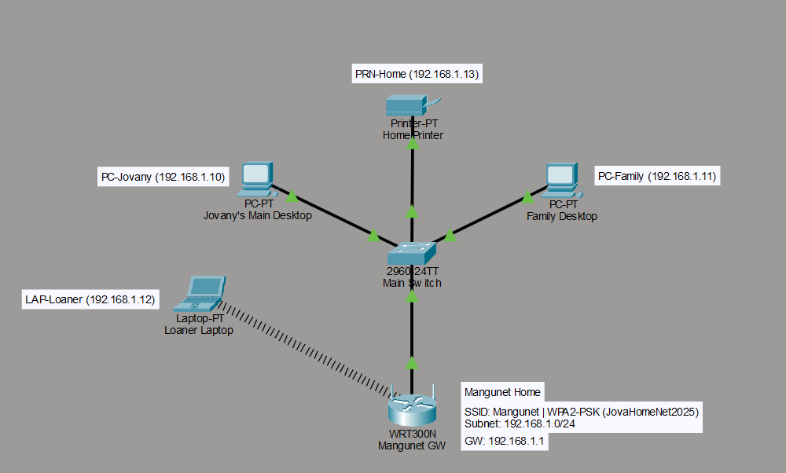

#Mangunet Home Network
**Lab Type:** Cisco Packet Tracer Simulation
**Objective:** Simulate a realistic home LAN and Wi-Fi network with both wired and wireless clients under the SSID "Mangunet".

## Topology Overview

**SSID:** Mangunet  
**Security:** WPA2-PSK (JovaHomeNet2025)  
**Subnet:** 192.168.1.0/24  
**Gateway:** 192.168.1.1  
**DHCP Range:** 192.168.1.100–192.168.1.150  
**DNS:** 8.8.8.8

---

## Devices and IP Scheme

| Device | Hostname | IP Address | Connection | Description |
|---------|-----------|-------------|-------------|--------------|
| Router | R1 - Mangunet GW | 192.168.1.1 | Wired | Default gateway |
| Switch | SW1 - Main Switch | — | Wired | Layer 2 switch |
| PC (You) | PC-Jovany | 192.168.1.10 | Wired | Main desktop |
| PC (Family) | PC-Family | 192.168.1.11 | Wired | Shared desktop |
| Laptop | LAP-Loaner | 192.168.1.12 | Wireless | Wi-Fi client |
| Printer | PRN-Home | 192.168.1.13 | Wired | Shared printer |

---

## Verification
- All nodes successfully ping each other and the gateway.  
- Wireless client connects to SSID “Mangunet” with WPA2-PSK.  
- Printer reachable at `192.168.1.13`.

---

## Lessons Learned
- IP addressing and subnetting fundamentals
- Configuring default gateways and verifying connectivity  
- Setting up wireless networks with WPA2-PSK security  
- Organizing and documenting network topologies clearly  

---

## Next Steps
- Add VLAN segmentation for separate network zones (Work, Family, IoT).  
- Implement a pfSense firewall for traffic control and routing.  
- Add a local DNS or file server for advanced management and testing.
